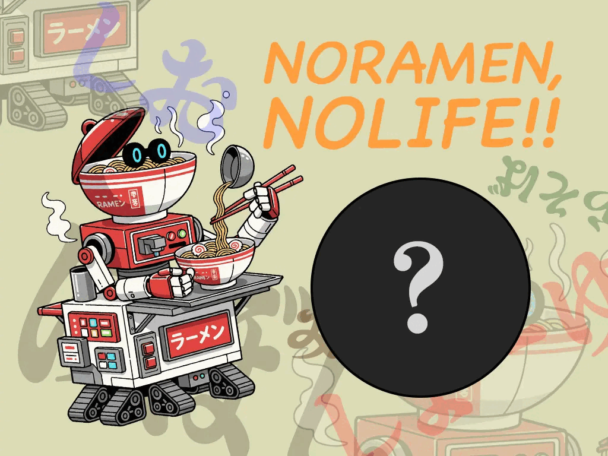

# 🍜 RAMEN ROBOT




> **NO RAMEN, NO LIFE.**

食べたいラーメンの種類を選ぶと、
ラーメンロボがおすすめのお店をランダムで紹介してくれるWebアプリです。

醤油・味噌・煮干し・塩・油そばの中からジャンルを選択すると、
おすすめのお店・最寄り駅・Google Mapを表示します。

---

## 🤖 About

「ラーメンが食べたいけど、どこに行くか決められない」

そんなときに、ラーメンロボが代わりにお店を選んでくれるミニWebアプリです。

ラーメンのジャンルごとに店舗データを用意し、
JavaScriptを使って選択されたジャンルの中からランダムに1店舗を表示しています。

---

## 🍥 Ramen Category

選べるラーメンの種類は以下の5種類です。

* 🍜 醤油らぁめん
* 🫘 味噌らぁめん
* 🐟 煮干しらぁめん
* 🧂 塩らぁめん
* 🔥 油そば

---

## ✨ Features

### ラーメンのジャンルを選択

セレクトボックスから食べたいラーメンの種類を選択できます。

### おすすめ店舗をランダム表示

選択されたジャンルに登録されている店舗の中から、
JavaScriptのMath.random()を利用して1店舗をランダムに選択します。

同じジャンルを選んでも、別のお店が表示されることがあります。

### 最寄り駅を表示

選ばれたラーメン店とあわせて、最寄り駅を表示します。

### Google Mapを表示

おすすめされた店舗のGoogle Mapを画面内に表示し、
お店の場所をすぐ確認できるようにしています。

---

## 🛠 Technologies

* HTML
* CSS
* JavaScript
* ES Modules
* Google Maps Embed
* Google Fonts

---

## 💡 What I Learned

この作品では、JavaScriptを使った以下の処理を練習しました。

* DOM要素の取得
* clickイベントの処理
* select要素から値を取得する方法
* オブジェクトと配列を使ったデータ管理
* Math.random()を使ったランダム処理
* innerHTMLを使ったGoogle Mapの表示
* JavaScriptファイルの分割
* import / exportを使ったモジュール化

特に、店舗データをメインの処理とは別のJavaScriptファイルに分けることで、
「データ」と「画面を動かす処理」を分離することを意識しました。

---

## 📁 Directory

```text
02_smallworks_ramen-robot/
│
├── assets/
│   ├── css/
│   │   └── style.css
│   │
│   ├── img/
│   │
│   └── js/
│       ├── list.js
│       └── main.js
│
├── index.html
└── README.md
```

### main.js

ユーザーが選択したラーメンの種類を取得し、
該当する店舗一覧からランダムで1店舗を選択して画面に表示します。

### list.js

ラーメン店の情報をジャンルごとに管理しています。

各店舗には主に、

* 店舗名
* 最寄り駅
* Google Map

の情報を持たせています。

---

## 🎨 Design

ラーメンを紹介する「ロボット」というコンセプトに合わせて、
少しレトロでゲームのような雰囲気のUIを意識しました。

Google FontsのDotGothic16を使用し、
ロボットのセリフのような表現も取り入れています。

---

## 🚀 Future Improvements

今後追加してみたい機能です。

* 店舗画像の表示
* ラーメンの価格帯による絞り込み
* 現在地から近い店舗の検索
* お気に入り機能
* 食べたラーメンの記録
* ラーメン店データの追加
* レスポンシブ対応の改善
* Google Maps APIを利用した地図機能の拡張

---

## 👤 Author

**Hashio**

GitHub
https://github.com/hashio251

---

# 🍜 NO RAMEN, NO LIFE.

今日の一杯を、ラーメンロボに決めてもらおう。
